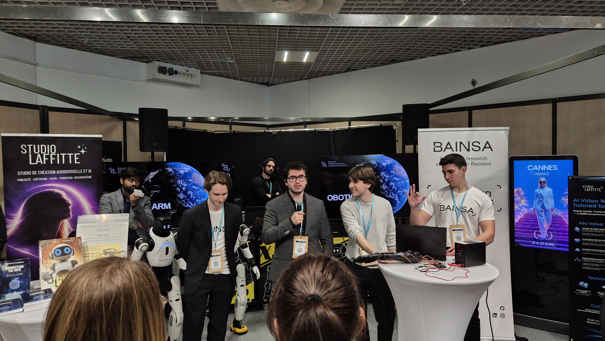

# EMG Prosthetic Arm — Intent Classification

End-to-end research prototype for **classifying muscle intent from surface EMG signals** and using those predictions as a control layer for a prosthetic robotic arm.

The project is built around a shared EMG data pipeline and three complementary modelling tracks:

- **Classic ML** — interpretable feature-based baselines.
- **CNN** — time-frequency image classification using spectrograms.
- **RNN / BRNN** — temporal sequence models for rolling EMG windows.

  

<em>Project presentation and live demonstration booth.</em>

---

## Table of Contents

- [Project Overview](#project-overview)
- [Motivation](#motivation)
- [System Pipeline](#system-pipeline)
- [Repository Structure](#repository-structure)
- [Installation](#installation)
- [Quick Start](#quick-start)
- [Data Format](#data-format)
- [Preprocessing](#preprocessing)
- [Modelling Tracks](#modelling-tracks)
- [Evaluation](#evaluation)
- [Project Demo](#project-demo)
- [Presentations](#presentations)
- [Roadmap](#roadmap)
- [Project Status](#project-status)
- [Team](#team)
- [License](#license)

---

## Project Overview
