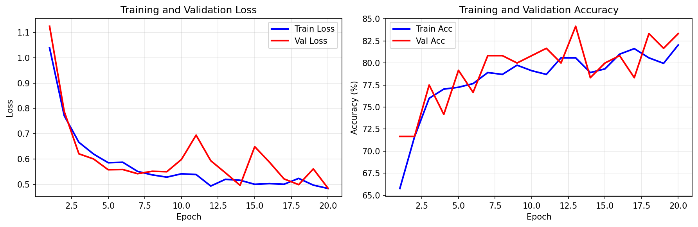
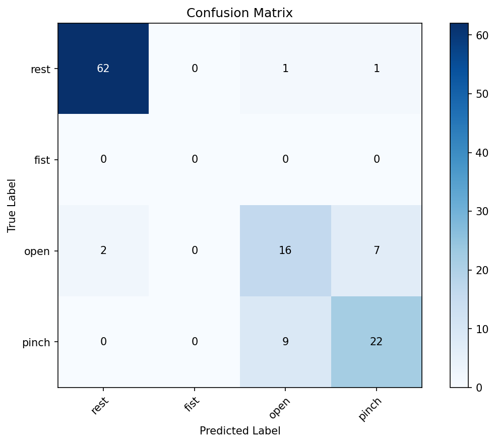
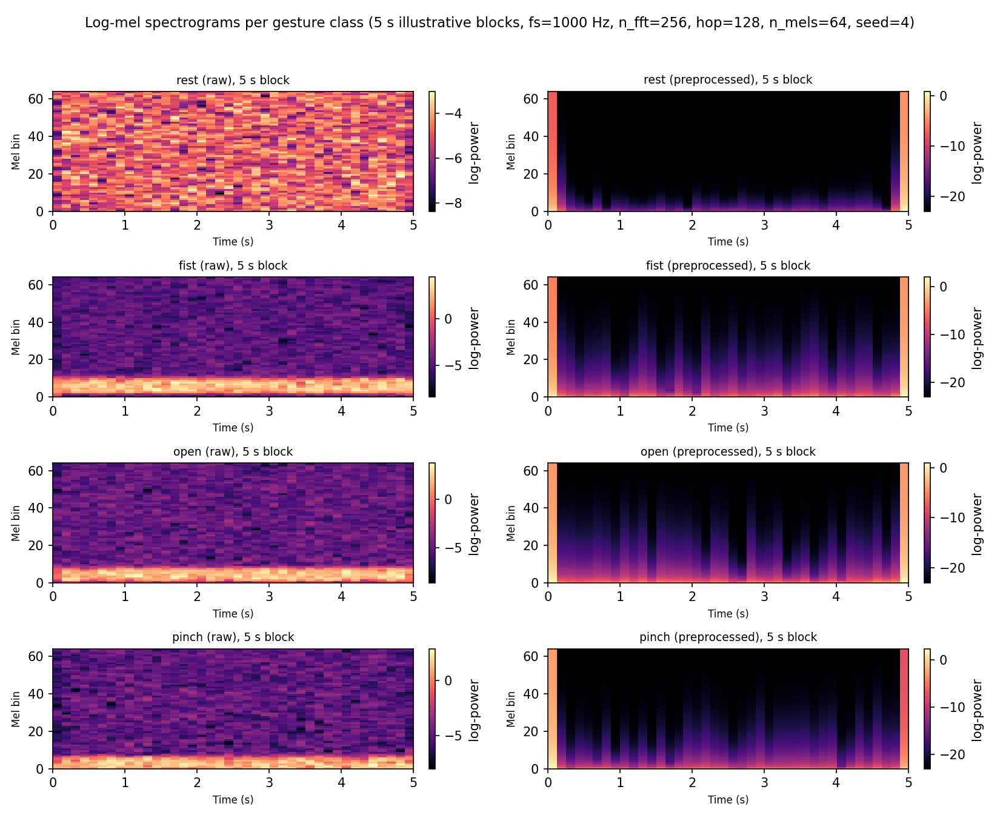
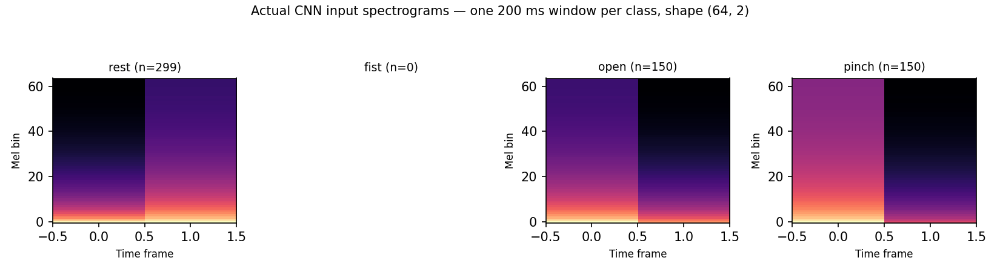

# Prosthetic Arm — EEG/EMG Intent Classification

[](https://www.python.org/)
[](LICENSE)
[](#project-status)
[](https://pytorch.org/)
[](#system-pipeline)

End-to-end research prototype for classifying **human motor intent from EEG/EMG biosignals** and translating those predictions into a control layer for a prosthetic robotic arm.

The project focuses primarily on **surface electromyography (sEMG)** classification, while also following a broader **EEG/EMG human-machine interface** direction for assistive robotics. It combines biosignal acquisition, preprocessing, windowing, feature extraction, machine learning, deep learning, and prosthetic control concepts.

The repository is organized around three complementary modelling tracks:

- **Classic Machine Learning** — interpretable feature-based baselines.
- **CNN Models** — time-frequency image classification using spectrograms.
- **RNN / BRNN Models** — temporal sequence models for rolling biosignal windows.

<p align="center">
  
</p>

<p align="center">
  <em>Project presentation and live demonstration booth at WAICF, Cannes.</em>
</p>

---

## Table of Contents

- [Project Overview](#project-overview)
- [Motivation](#motivation)
- [System Pipeline](#system-pipeline)
- [Repository Structure](#repository-structure)
- [Installation](#installation)
- [Quick Start](#quick-start)
- [Biosignal Data Format](#biosignal-data-format)
- [Signal Preprocessing](#signal-preprocessing)
- [Windowing](#windowing)
- [Modelling Tracks](#modelling-tracks)
- [Evaluation Protocol](#evaluation-protocol)
- [Metrics](#metrics)
- [Project Demo](#project-demo)
- [Reproducibility](#reproducibility)
- [Roadmap](#roadmap)
- [Project Status](#project-status)
- [Team](#team)
- [License](#license)
- [Disclaimer](#disclaimer)

---

## Project Overview

This project investigates how **EEG and EMG biosignals** can be used to infer user intent for prosthetic arm control.

In the current implementation, the repository focuses mainly on **surface EMG classification**. EMG signals are collected from muscle activity, processed into usable windows, and classified using machine learning and deep learning models. The resulting class predictions can then be used as a high-level control signal for a prosthetic robotic arm.

The broader research direction is to combine:

- **EMG**, which captures muscle activation.
- **EEG**, which captures neural activity.
- **Robotic control**, which translates predicted intent into prosthetic movement.

This project is a **research prototype**, not a finished medical device. It is intended for experimentation in biosignal processing, machine learning, human-machine interfaces, and assistive robotics.

---

## Motivation

Modern prosthetic systems require reliable and intuitive control methods. Traditional mechanical or button-based interfaces can be limiting because they do not directly capture the user's intended motion.

Biosignals offer a more natural control path:

- **EMG signals** can indicate muscle activation patterns associated with gestures or intended movements.
- **EEG signals** can provide an additional neural-control layer for future intent recognition.
- **Machine learning models** can map these signals to discrete commands or movement classes.
- **Robotic prosthetic systems** can use those commands to trigger functional hand or arm actions.

The purpose of this project is to explore how these components can be combined into a practical experimental pipeline.

---

## System Pipeline

The system follows a modular biosignal-processing pipeline:

```text
EEG / EMG Signal Acquisition
            ↓
Signal Cleaning and Preprocessing
            ↓
Windowing / Segmentation
            ↓
Feature Extraction or Spectrogram Generation
            ↓
Machine Learning / Deep Learning Classification
            ↓
Predicted Motor Intent
            ↓
Prosthetic Arm Control Layer
```

The pipeline is designed to support both offline experimentation and future real-time inference.

---

## Repository Structure

```text
emg_classification/
├── configs/
│   ├── preprocessing.yaml            # Sampling, filtering, windowing and normalization settings
│   └── gestures.yaml                 # Gesture classes and trial protocol
│
├── src/
│   ├── common/
│   │   ├── io/
│   │   │   ├── schemas.py            # Shared constants, schemas and file patterns
│   │   │   └── dummy_data.py         # Synthetic EMG generation for testing
│   │   │
│   │   ├── preprocessing/
│   │   │   ├── pipelines.py          # Raw/envelope preprocessing functions
│   │   │   └── windowing.py          # Signal windowing and majority-label logic
│   │   │
│   │   └── utils/
│   │       └── config.py             # YAML configuration loader
│   │
│   ├── classic_ml/
│   │   ├── features/
│   │   │   ├── time_domain.py        # Time-domain EMG features
│   │   │   └── freq_domain.py        # Frequency-domain EMG features
│   │   │
│   │   ├── datasets/
│   │   │   └── classic_ml_dataset.py # Dataset preparation for classic ML
│   │   │
│   │   └── models/
│   │       └── train_classic.py      # Classic ML training script
│   │
│   ├── cnn/
│   │   ├── transforms/
│   │   │   └── spectrograms.py       # Spectrogram generation
│   │   │
│   │   ├── datasets/
│   │   │   └── cnn_dataset.py        # Dataset preparation for CNN models
│   │   │
│   │   └── models/
│   │       ├── model_cnn.py          # CNN architecture
│   │       └── train_cnn.py          # CNN training script
│   │
│   └── rnn/
│       ├── features/
│       │   └── seq_features.py       # Sequence feature extraction
│       │
│       ├── datasets/
│       │   └── sequence_dataset.py   # Dataset preparation for RNN models
│       │
│       └── models/
│           ├── model_rnn.py          # RNN / BRNN architecture
│           └── train_rnn.py          # RNN training script
│
├── assets/
│   ├── demo/
│   │   ├── prosthetic_arm_demo.gif
│   │   └── prosthetic_arm_demo_frame.jpg
│   │
│   └── presentations/
│       └── 20260213_114047.jpg
│
├── requirements.txt
├── LICENSE
└── README.md
```

The repository currently contains the main project folders `configs`, `src`, `requirements.txt`, `LICENSE`, and `README.md`. The `assets/` folder can be added to include photos, demo GIFs, and presentation material.

---

## Installation

### 1. Clone the repository

```bash
git clone https://github.com/Hugo132645/emg_classification.git
cd emg_classification
```

### 2. Create a virtual environment

```bash
python -m venv .venv
```

Activate it:

```bash
# Windows
.venv\Scripts\activate
```

```bash
# macOS / Linux
source .venv/bin/activate
```

### 3. Install dependencies

```bash
pip install -r requirements.txt
```

The project is designed for Python 3.10+.

---

## Quick Start

After installation, the typical workflow is:

```text
1. Prepare or load biosignal data
2. Apply preprocessing and windowing
3. Train one of the model tracks
4. Evaluate model performance
5. Use predictions as prosthetic control commands
```

Example training entry points may include:

```bash
python src/classic_ml/models/train_classic.py
```

```bash
python src/cnn/models/train_cnn.py
```

```bash
python src/rnn/models/train_rnn.py
```

Depending on your local implementation, configuration files in `configs/` should be adjusted before running experiments.

---

## Biosignal Data Format

The main data format is intended to be **Parquet**, with optional CSV exports for inspection.

Suggested raw-data path:

```text
data/raw/{subject_id}/{session_date}/session_{session_id}.parquet
```

Suggested processed-data path:

```text
data/processed/
```

Recommended columns:

| Column | Type | Description |
|---|---:|---|
| `timestamp_ms` | `int64` | Timestamp in milliseconds |
| `emg_ch1_raw` | `int16` / `float` | Raw EMG channel signal |
| `emg_ch1_env` | `float32` | EMG envelope signal, if available |
| `eeg_ch*_raw` | `float32` | Optional EEG channel values |
| `label` | `string` | Gesture or intent class |
| `subject_id` | `string` | Participant identifier |
| `session_id` | `string` | Recording session identifier |
| `trial_id` | `int` | Trial index |
| `marker` | `int` | Optional cue or event marker |
| `notes` | `string` | Optional recording notes |

The current pipeline is EMG-centered, but the schema is written so that EEG channels can be added later.

---

## Signal Preprocessing

The shared preprocessing layer is responsible for preparing raw biosignals before modelling.

For EMG, the expected preprocessing steps are:

```text
Raw EMG
  ↓
Band-pass filtering
  ↓
Notch filtering
  ↓
Rectification
  ↓
Envelope extraction
  ↓
Normalization
  ↓
Windowing
```

Typical EMG preprocessing operations include:

- Band-pass filtering to isolate the useful EMG frequency range.
- Optional notch filtering to reduce power-line noise.
- Rectification to convert the signal into absolute amplitude.
- Low-pass filtering to extract the muscle activation envelope.
- Session-level normalization.
- Sliding-window segmentation.

The shared preprocessing functions are located in:

```text
src/common/preprocessing/
```

---

## Windowing

The windowing module converts continuous biosignals into fixed-length samples for model training.

Typical configuration:

```text
Window length: 200 ms
Hop length:    100 ms
```

For each window, the pipeline returns:

```text
windows   -> signal windows
labels    -> majority label per window
times_ms  -> start and end timestamp of each window
```

This allows all model tracks to use the same segmentation strategy.

---

## Modelling Tracks

### 1. Classic Machine Learning

The classic ML pipeline uses hand-crafted features extracted from each EMG window.

Typical time-domain features include:

- RMS — Root Mean Square
- MAV — Mean Absolute Value
- Standard deviation
- Variance
- Waveform length
- Zero crossings
- Slope sign changes
- Willison amplitude
- Hjorth parameters
- Autoregressive coefficients

Typical frequency-domain features include:

- Welch power spectral density
- Mean frequency
- Median frequency
- Band powers
- Spectral entropy

Possible models:

- Logistic Regression
- Support Vector Machine
- Random Forest
- Gradient Boosting / XGBoost

This track is useful because it is interpretable, fast to train, and suitable as a baseline.

---

### 2. CNN — Time-Frequency Classification

The CNN track converts each windowed EMG segment into a log-mel spectrogram and classifies gestures with a lightweight 2D convolutional network. It is implemented across three files:

```text
src/cnn/transforms/spectrograms.py   # Log-mel spectrogram computation (STFT + mel filterbank)
src/cnn/datasets/cnn_dataset.py      # PyTorch Dataset wrapper around spectrogram arrays
src/cnn/models/model_cnn.py          # EMGConvNet architecture
src/cnn/models/train_cnn_dummy.py    # End-to-end training/evaluation pipeline
```

```text
EMG Window (200 ms)
        ↓
Log-Mel Spectrogram (STFT → mel filterbank → log)
        ↓
SpectrogramDataset  (numpy → tensor, label encoding)
        ↓
EMGConvNet  (3 conv blocks → global average pool → FC)
        ↓
Intent Class
```

This track lets the model learn directly from a time-frequency image of the signal instead of hand-crafted features, at the cost of needing more data and compute than the classic ML baselines.

---

#### Spectrogram Generation

The file `src/cnn/transforms/spectrograms.py` turns a 1D EMG window into a 2D log-mel spectrogram using `librosa`.

```python
compute_stft_spectrogram(window, fs, n_fft=256, hop_length=128,
                          n_mels=64, fmin=20.0, fmax=None, log_offset=1e-10)
```

Processing steps:

1. **STFT** — `librosa.stft` with a Hann window, `n_fft=256`, `hop_length=128`.
2. **Power spectrum** — squared magnitude of the complex STFT.
3. **Mel filterbank** — `librosa.filters.mel(sr=fs, n_fft=256, n_mels=64, fmin=20.0, fmax=fs/2)` projects the linear-frequency power spectrum onto 64 mel bands.
4. **Log compression** — `log(mel_power + 1e-10)` to keep dynamic range CNN-friendly.

`batch_compute_spectrograms(windows, fs, ...)` loops this over an array of windows and stacks the result into a single `(N, n_mels, time_frames)` array — this is the function the training script calls once per dataset.

| Parameter | Value used in `train_cnn_dummy.py` | Meaning |
|---|---:|---|
| `n_fft` | 256 | FFT size per STFT frame |
| `hop_length` | 128 | Samples between STFT frames (spectrogram time resolution) |
| `n_mels` | 64 | Number of mel frequency bins |
| `fmin` / `fmax` | 20 Hz / 500 Hz | Mel filterbank frequency range |

> **Requires `fs ≈ 1000 Hz`.** With a 200-sample window (200 ms @ 1 kHz) and `hop_length=128`, this configuration produces spectrograms of shape `(64, 2)` — 64 mel bins by 2 time frames. See [Reproducibility Notes](#reproducibility-notes-cnn) below for why the sample rate matters and what happens if it isn't 1 kHz.

---

#### CNN Dataset

`src/cnn/datasets/cnn_dataset.py` defines `SpectrogramDataset`, a thin `torch.utils.data.Dataset` wrapper:

```python
dataset = SpectrogramDataset(spectrograms, labels, cfg)   # spectrograms: (N, n_mels, T) float array
spec_tensor, label_idx = dataset[0]                        # (1, n_mels, T) tensor, int label
weights = dataset.compute_class_weights()                  # inverse-frequency weights, for nn.CrossEntropyLoss(weight=...)
train_ds, val_ds = train_val_split(dataset, train_ratio=0.8, seed=42)
```

| Output | Meaning |
|---|---|
| `spec_tensor` | `(1, n_mels, time_frames)` — a channel dimension is added so 2D convolutions treat the spectrogram like a single-channel image |
| `label_idx` | Integer class index, taken from `cfg.label_map` (e.g. `{'rest': 0, 'fist': 1, 'open': 2, 'pinch': 3}`) |

`compute_class_weights()` returns `N / (num_classes * count_i)` per class, for use with a weighted cross-entropy loss on imbalanced gesture distributions. `train_val_split()` shuffles indices with a fixed seed and splits by ratio, rebuilding two `SpectrogramDataset` instances from the resulting subsets.

---

#### Model Architecture — `EMGConvNet`

`src/cnn/models/model_cnn.py` defines a lightweight ConvNet sized for small spectrograms and CPU training:

```text
Input: (B, 1, n_mels, time_frames)
├─ ConvBlock1:  1 →  32 channels, 3×3 conv, BatchNorm, ReLU, MaxPool 2×2
├─ ConvBlock2: 32 →  64 channels, 3×3 conv, BatchNorm, ReLU, NO pooling
├─ ConvBlock3: 64 → 128 channels, 3×3 conv, BatchNorm, ReLU, NO pooling
├─ Global Average Pooling → (B, 128)
├─ Dropout (p=0.3)
└─ Fully Connected: 128 → num_classes
```

Design notes (from the source):

- **Only the first block pools.** Spectrograms this small (as narrow as 2 time frames) collapse to zero spatial size if every block pools; blocks 2 and 3 use `pool_size=1` (no-op pooling) to preserve spatial dimensions.
- **Global average pooling** before the classifier makes the network agnostic to the exact `(n_mels, time_frames)` shape, so it tolerates windows of slightly different length.
- **BatchNorm + ReLU** in every block; conv layers use `bias=False` since BatchNorm makes the bias redundant.

`model.extract_features(x)` returns the 128-dim pooled embedding before the classifier head, for embedding inspection (e.g. t-SNE) if needed later.

For `num_classes=4` (rest / fist / open / pinch), the model measures at **93,412 trainable parameters** (~0.36 MB in float32) — see [Reproduced Results](#reproduced-results-cnn) for how this was measured.

---

#### Training Pipeline

`src/cnn/models/train_cnn_dummy.py` runs the full pipeline end to end, on synthetic ("dummy") EMG data generated by `src/common/io/dummy_data.py`:

```text
Generate dummy EMG (60 s, 3 active gesture classes + rest)
        ↓
preprocess_raw(): bandpass(20–450 Hz) → rectify → lowpass(10 Hz) → z-score
        ↓
window_signal(): 200 ms windows, 100 ms hop, majority-vote labels
        ↓
batch_compute_spectrograms(): (N, 64, time_frames) log-mel spectrograms
        ↓
SpectrogramDataset + train_val_split(train_ratio=0.8)
        ↓
EMGConvNet training (CrossEntropyLoss, Adam)
        ↓
Validation metrics + confusion matrix
        ↓
Save best checkpoint + training curve / confusion matrix plots
```

| Setting | Value |
|---|---:|
| Epochs | 20 |
| Batch size | 32 |
| Learning rate | 0.001 (Adam) |
| Train / val split | 80% / 20% |
| Seed | 42 |
| Device | CPU |
| Dummy data duration | 60 s, 5 s gesture blocks |

---

#### Reproduced Results <a name="reproduced-results-cnn"></a>

The numbers and figures below come from an actual execution of the pipeline above (`src/cnn/transforms/spectrograms.py`, `src/cnn/datasets/cnn_dataset.py`, `src/cnn/models/model_cnn.py`, `src/cnn/models/train_cnn_dummy.py`, imported and run unmodified), on synthetic EMG — **not** on real biosignal recordings. Treat these as a pipeline sanity-check, not a gesture-recognition accuracy claim.

Run configuration: `seed=42`, `sample_rate_hz=1000` (see [Reproducibility Notes](#reproducibility-notes-cnn) for why the sample rate was overridden from the config file's default), `window_ms=200`, `hop_ms=100`, gestures = `rest, fist, open, pinch`.

Environment: Python 3.11.7, `numpy==1.26.4`, `torch==2.9.1+cpu`, `librosa==0.11.0`, `scikit-learn==1.7.2`, `matplotlib==3.10.7`, `scipy==1.16.3`. The exact percentages below should reproduce closely with a fixed seed on these versions; minor floating-point/BLAS differences across platforms or library versions can shift them slightly.

```text
Windows generated:        599   (rest: 299, open: 150, pinch: 150, fist: 0 — see notes)
Spectrogram shape:        (599, 64, 2)   — 64 mel bins × 2 time frames per window
Train / val split:        479 / 120
Model:                     EMGConvNet, 93,412 trainable parameters
Training time:             ~3.0 s for 20 epochs (CPU)
Best validation accuracy:  84.17% (epoch 13 of 20)
Final validation macro-F1: 0.7725
```

Classification report (final epoch, validation set, `zero_division=0`):

```text
              precision    recall  f1-score   support

        rest       0.97      0.97      0.97        64
        fist       0.00      0.00      0.00         0
        open       0.62      0.64      0.63        25
       pinch       0.73      0.71      0.72        31

    accuracy                           0.83       120
   macro avg       0.58      0.58      0.58       120
weighted avg       0.83      0.83      0.83       120
```

The `fist` row has zero support: with `seed=42`, none of the twelve 5-second blocks drawn for this 60-second run happened to be labelled `fist`, so the class is absent from the entire dataset, not just the validation split. This is a property of the random block sampler in `generate_dummy_emg` over a short 60 s draw, not a training failure — macro-F1 is computed over all four configured classes regardless.

<p align="center">
  
</p>
<p align="center"><em>Training/validation loss and accuracy over 20 epochs.</em></p>

<p align="center">
  
</p>
<p align="center"><em>Validation confusion matrix (rest / fist / open / pinch). Rest is separated cleanly; open and pinch are the main source of confusion, consistent with both being lower-amplitude, adjacent gesture classes in the synthetic generator.</em></p>

---

#### Spectrogram Examples

<p align="center">
  
</p>
<p align="center"><em>Log-mel spectrograms of one representative 5-second gesture block per class, computed with <code>compute_stft_spectrogram</code> (fs=1000 Hz, n_fft=256, hop=128, n_mels=64). Left column: spectrogram of the raw synthetic EMG. Right column: spectrogram of the same block after the pipeline's bandpass → rectify → lowpass(10 Hz) → z-score preprocessing.</em></p>

<p align="center">
  
</p>
<p align="center"><em>The actual tensors the CNN sees: one 200 ms window per class, shape (64 mel bins, 2 time frames) — this is the true input resolution of <code>EMGConvNet</code> under the current windowing configuration.</em></p>

**What the preprocessed spectrograms show.** After `preprocess_raw`'s lowpass at 10 Hz, almost all remaining signal energy sits below the mel filterbank's 20 Hz floor, so the classifier is not looking at raw EMG frequency content (20–450 Hz muscle activation spectrum) in these spectrograms — it is looking at how the low-frequency envelope leaks into the lowest mel bins, and how that leakage is modulated in time as the synthetic gesture bursts turn on and off. This is a legitimate, learnable signal (it is what separates the classes above chance), but it should not be read as "the CNN sees EMG frequency content" — see the note below.

This was checked quantitatively, not just visually: the 4th-order Butterworth lowpass at 10 Hz used in `preprocess_raw` attenuates by **−24 dB at 20 Hz**, **−56 dB at 50 Hz**, and **−184 dB at 450 Hz** (computed via `scipy.signal.freqz`). By the time a signal reaches the mel filterbank's 20 Hz floor, over 99.5% of its power (in linear terms, a gain of ≈0.06) has already been removed, and content near the bandpass's original 450 Hz edge is gone entirely.

---

#### Reproducibility Notes <a name="reproducibility-notes-cnn"></a>

Two implementation details had to be worked around to get an end-to-end run out of the current code, and are recorded here rather than silently patched:

1. **Sample rate / bandpass mismatch.** `configs/preprocessing.yaml` currently sets `sample_rate_hz: 100`, but `train_cnn_dummy.py` preprocesses with a fixed `band=(20, 450)` Hz Butterworth bandpass. A bandpass filter requires `high < Nyquist = fs/2`; at `fs=100 Hz` the Nyquist frequency is 50 Hz, so `high=450` is invalid and `preprocess_raw` raises `ValueError: Invalid bandpass... Ensure 0 < low < high < fs/2`. The spectrogram module's own docstrings/self-tests and `src/cnn/README.md` both assume `fs=1000 Hz` ("200 samples @ 1kHz"), so the results above were produced with `sample_rate_hz` overridden to `1000` on the config object passed into the pipeline. Nothing else was changed. Before running the CNN track from `configs/preprocessing.yaml` as-is, either raise `sample_rate_hz` to something compatible with a 450 Hz bandpass edge (≥ ~1000 Hz), or lower the bandpass/window parameters to match a 100 Hz signal.
2. **`train_val_split` reloads config from a relative path.** `src/cnn/datasets/cnn_dataset.py`'s `train_val_split()` always calls `SpectrogramDataset(..., cfg=None, ...)`, which makes the dataset reload configuration via `load_cfg("configs/preprocessing.yaml")` — a path relative to the current working directory, not the repo root. If the training script is invoked from any directory other than the project root, this silently falls back to the hardcoded defaults in `schemas.py` (which have no `label_map`/`gestures`), and raises `AttributeError: 'SimpleNamespace' object has no attribute 'label_map'`. Run training scripts from the repository root until this is fixed.
3. **`n_fft=256` on a 200-sample window.** `librosa` emits `UserWarning: n_fft=256 is too large for input signal of length=200` for every window, since the FFT size exceeds the window length. `librosa` zero-pads internally so the call still succeeds, but it means part of each spectrogram's frequency resolution is coming from zero-padding rather than real samples — worth reducing `n_fft` (e.g. to 128 or 64) if this is revisited.
4. **Dummy data only.** All figures and metrics above come from `generate_dummy_emg`'s synthetic, band-limited noise bursts, not from recorded EMG. They validate that the spectrogram → dataset → model → training loop runs correctly and can separate synthetic classes above chance; they say nothing about real-world gesture classification accuracy.

---

#### Why This Track Matters

The CNN track is useful because it removes the need to hand-design frequency-domain descriptors: the mel filterbank and convolutional layers learn which time-frequency patterns are discriminative directly from data, rather than relying on the fixed feature set used by the classic ML track. Its main current limitation is upstream of the model — the shared preprocessing pipeline low-pass filters the signal to a 10 Hz envelope before the spectrogram is computed, which limits how much genuine EMG spectral information (as opposed to envelope-modulation timing) the CNN actually has access to. Feeding the CNN track a less aggressively low-passed signal — e.g. the rectified, band-passed signal without the 10 Hz envelope step — is the most direct way to let it exploit real time-frequency muscle-activation structure once real EMG recordings are available.

---

### 3. RNN / BRNN — Temporal Sequence Models

The RNN track models **temporal dependencies across consecutive EMG windows**. Instead of treating each signal window as an isolated sample, this pipeline converts windowed EMG recordings into sequences of feature vectors and trains recurrent neural networks to classify the user's intended movement.

This is especially relevant for prosthetic control because muscle activation patterns evolve over time. A single EMG window may be noisy or ambiguous, while a short sequence of windows can provide a clearer representation of the intended gesture.

```text
Windowed EMG Signal
        ↓
Sequential Feature Extraction
        ↓
Feature Standardization
        ↓
FeatureSequenceDataset
        ↓
GRU / LSTM / Bidirectional Recurrent Model
        ↓
Intent Class Prediction
```

#### Sequence Feature Extraction

The file `src/rnn/features/seq_features.py` contains the feature-extraction logic used before training the recurrent models.

The function `compute_seq_features()` converts each EMG window into a compact numerical feature vector. These feature vectors are then arranged into temporal sequences for RNN-based classification.

The current feature extraction supports multiple groups of descriptors:

| Feature group | Description |
|---|---|
| Statistical features | Mean, standard deviation, minimum, maximum, range, and zero-crossing rate |
| Shape-based features | Signal slope, skewness, and kurtosis-style descriptors |
| Spectral features | Frequency-domain information such as centroid, bandwidth, and spectral power |

In the RNN training pipeline, spectral features are enabled when the feature vectors are generated:

```python
ft_vectors, ft_names = compute_seq_features(
    windows,
    sample_rate,
    spectral_feat=True
)
```

This produces a feature matrix where each row corresponds to one EMG window and each column corresponds to a calculated feature.

#### Sequence Dataset

The file `src/rnn/datasets/sequence_dataset.py` defines the `FeatureSequenceDataset` class.

This dataset groups consecutive EMG feature vectors into fixed-length temporal sequences. Each sequence becomes one training sample for the recurrent model.

```text
Feature vector 1
Feature vector 2
Feature vector 3
...
Feature vector N
        ↓
Sequence of consecutive feature vectors
        ↓
RNN input sample
```

Each dataset sample contains:

| Output | Meaning |
|---|---|
| `x` | Input tensor with shape `[sequence_length, feature_dim]` |
| `y_seq` | Labels for the windows inside the sequence |
| `y` | Majority label for the sequence |
| `length` | Actual sequence length |
| `names` | Feature names used in the input vector |

The current RNN training setup uses overlapping temporal sequences, allowing the model to learn how EMG features change over time.

#### Feature Standardization

Before training, the feature vectors are standardized using a custom `Standardizer`.

Standardization transforms the input features so that each feature has a comparable scale:

```text
standardized_feature = (feature - mean) / standard_deviation
```

This is important because recurrent neural networks are sensitive to feature scale. Without standardization, features with larger numeric values can dominate the learning process.

The trained model artifact stores the standardization parameters together with the model, making it possible to apply the same transformation later during inference.

Stored metadata includes:

```text
standardizer_mean
standardizer_std
feature_names
label_map
```

#### Recurrent Model Architecture

The file `src/rnn/models/model_rnn.py` defines the recurrent model architectures used for temporal EMG classification.

The main recurrent models are:

| Model | Purpose |
|---|---|
| `GRUModel` | Gated Recurrent Unit model for temporal EMG classification |
| `LSTMModel` | Long Short-Term Memory model for temporal EMG classification |

The recurrent architecture follows this structure:

```text
Input sequence: [batch_size, sequence_length, feature_dim]
        ↓
GRU / LSTM recurrent layers
        ↓
Last valid hidden state
        ↓
Fully connected classification layer
        ↓
Class logits
```

The models support:

- Configurable hidden dimension.
- Multiple recurrent layers.
- Dropout.
- Optional bidirectional recurrent processing.
- Variable sequence lengths through the `lengths` argument.

The RNN track is therefore suitable for both simple temporal baselines and more advanced bidirectional sequence models.

#### Training Pipeline

The training script is located at:

```text
src/rnn/models/train_rnn.py
```

The script performs the complete RNN training workflow:

```text
Load preprocessing configuration
        ↓
Generate or load EMG data
        ↓
Apply shared windowing pipeline
        ↓
Extract sequential features
        ↓
Encode gesture labels
        ↓
Standardize feature vectors
        ↓
Build FeatureSequenceDataset
        ↓
Split into training and validation sets
        ↓
Train recurrent model
        ↓
Evaluate validation performance
        ↓
Save model artifact
        ↓
Generate training diagnostics
```

The training loop uses:

- Cross-entropy loss.
- Adam optimization.
- Training and validation split.
- Best-model checkpointing.
- Validation accuracy tracking.
- Confusion-matrix evaluation.

The script also selects the best available compute device, supporting CPU, CUDA, and Apple Silicon acceleration where available.

#### Output Artifact

After training, the RNN pipeline saves a model artifact that contains both the trained weights and the metadata required for reuse.

The saved artifact includes:

```text
state_dict
model_type
input_dim
hidden_dim
num_layers
bidirectional
dropout
label_map
feature_names
standardizer_mean
standardizer_std
```

This makes the trained model easier to reload for later testing, comparison, or future real-time prosthetic-arm inference.

#### Why This Track Matters

The RNN/BRNN track is important because prosthetic control is inherently temporal. Muscle activation is not just defined by one instant of signal activity, but by the pattern of activation across time.

Compared with classic machine learning, the recurrent approach can capture temporal movement dynamics. Compared with CNN-based spectrogram classification, it focuses directly on the evolution of extracted EMG features across consecutive windows.

This makes the RNN/BRNN track a strong candidate for future real-time EEG/EMG prosthetic control, where stable and responsive intent prediction is essential.

---

## Evaluation Protocol

The project can be evaluated using two main modes.

### Within-subject evaluation

The model is trained and tested on data from the same subject, with trials split into training, validation, and test sets.

This measures how well the system can adapt to a specific user.

### Cross-subject evaluation

The model is trained on some subjects and tested on unseen subjects.

This measures how well the system generalizes across users.

---

## Metrics

Recommended metrics:

| Metric | Purpose |
|---|---|
| Accuracy | Overall classification correctness |
| Macro-F1 | Balanced performance across classes |
| Per-class F1 | Gesture-specific reliability |
| Confusion matrix | Error analysis between classes |
| Latency | Real-time control feasibility |
| Throughput | Inference speed |

The most important metric is **Macro-F1**, because prosthetic control requires reliable performance across all movement classes, not only the most frequent class.

---

## Project Demo

The project includes a physical prosthetic robotic arm prototype used for demonstrations and experimentation.

Demo media can be stored in:

```text
assets/demo/
```

Example:

```md
<p align="center">
  
</p>
```

Suggested demo caption:

```md
<p align="center">
  <em>Prototype demonstration of biosignal-based prosthetic arm control.</em>
</p>
```

---

## Reproducibility

For reproducible experiments, each run should save:

```text
run.json
config.yaml
metrics.json
confusion_matrix.png
model_weights.pt
```

Recommended information to store:

- Git commit hash.
- Random seed.
- Dataset version.
- Subject split.
- Preprocessing configuration.
- Model hyperparameters.
- Training duration.
- Evaluation metrics.

This makes experiments easier to compare across model tracks.

---

## Roadmap

Planned and potential future improvements:

- [ ] Add complete real-time serial data logger.
- [ ] Add EEG channel support in the common schema.
- [ ] Add multi-channel EMG support.
- [ ] Add synchronized EEG/EMG acquisition.
- [ ] Add live inference with rolling windows.
- [ ] Export trained models to ONNX.
- [ ] Benchmark inference latency on CPU and embedded hardware.
- [ ] Integrate predictions with prosthetic arm control.
- [ ] Add grip-force feedback.
- [ ] Add more presentation photos and demo videos.
- [ ] Improve cross-subject evaluation.
- [ ] Add automated tests for preprocessing and windowing.

---

## Project Status

This repository is currently a **research prototype**.

Current focus:

- Biosignal preprocessing.
- EMG windowing.
- Gesture / intent classification.
- Comparison of classic ML, CNN, and RNN-based approaches.
- Prosthetic arm control integration.

Not yet intended for:

- Clinical use.
- Medical diagnosis.
- Commercial prosthetic deployment.
- Safety-critical autonomous control.

---

## Team

Project developed by students and researchers interested in:

- Biosignal processing
- Machine learning
- EEG/EMG interfaces
- Assistive robotics
- Prosthetic arm control
- Human-machine interaction

Main repository maintainer:

```text
Hugo Arsénio
GitHub: @Hugo132645
```

Team members:

```md
- Tudor-Andrei Dolineaschi — Classic ML
- Maria Daria Dejeu — CNN
- Norbert Ceaser — RNN/BRNN
```

---

## License

This project is licensed under the MIT License.

See the [LICENSE](LICENSE) file for details.

---

## Disclaimer

This project is an educational and research prototype. It is not a certified medical device and should not be used for clinical, diagnostic, or safety-critical applications without proper validation, regulation, and expert supervision.
